<div align="center">
  <image src="image/banner.png"/>
    
  <br/>

  <a href="https://python.org">
    
  </a>
  <a href="https://langchain-ai.github.io/langgraph/">
    
  </a>
  <a href="https://lancedb.com/">
    
  </a>
  <a href="https://tavily.com/">
    
  </a>
  <a href="https://opensource.org/licenses/MIT">
    
  </a>  
  <br />
  <br />
  <p>
    <a href="README.md">English</a> | <a href="README_CN.md">中文</a>
  </p>
</div>

---

# 🌉 ApexBridge Deep Research System

**ApexBridge** is an industrial-grade, autonomous AI deep research agent designed to bridge the gap between complex questions and ground truth.

Unlike traditional RAG systems, ApexBridge employs a **"Plan-and-Solve"** architecture with **Multi-Agent Debate (MAD)** capabilities. It autonomously plans research paths, executes parallel searches, verifies facts, and engages in self-correction to produce high-quality, hallucination-free research reports.

## ✨ Key Features

* **🧠 Autonomous Planning (DAG)**: Dynamically decomposes complex topics into a Directed Acyclic Graph (DAG) of tasks using reasoning models.
* **⚖️ Multi-Agent Debate (MAD)**: Automatically escalates disputed facts to a "Courtroom" where affirmative and negative agents debate to reach a verdict, ensuring factual accuracy.
* **📉 Tiered Model Strategy**: Optimizes cost and speed by routing tasks to specific models (e.g., **DeepSeek R1** for planning/reasoning, **V3** for writing/extraction).
* **🛡️ Circuit Breakers & Safety**:
  * **Cognitive**: Vector-based semantic loop detection prevents redundant research paths.
  * **Resource**: Global timeouts and `Tenacity` retry mechanisms ensure robustness against network failures.
* **🔍 Dual Search Engine**:
  * **Tavily**: Native support for Multi-Key rotation and high-quality LLM-ready results.
  * **SearXNG**: Support for self-hosted, privacy-focused search.
* **📚 Isolated Knowledge**: Task-level vector isolation using **LanceDB** ensures data security and prevents context pollution between research sessions.

## 🏗️ Architecture

```mermaid
graph TD
    User[User Query] --> Planner
    
    subgraph "Orchestrator (LangGraph)"
        Planner(🧠 Planner / R1) -->|Generate DAG| Searcher
        
        subgraph "Perception Layer"
            Searcher(🌍 Searcher / Tavily) -->|Raw Data| Crawler(🕷️ Crawler)
            Crawler -->|Chunks| VectorDB[(LanceDB)]
        end
        
        Searcher -->|Task Complete| Planner
        
        Planner -->|All Tasks Done| Analyst
        
        subgraph "Cognition Layer"
            Analyst(📝 Analyst / V3) -->|Draft| Verification
            
            subgraph "Verification Loop"
                Verification{Verify Claims}
                Verification -->|Verified| Draft
                Verification -->|Disputed| MAD(⚖️ MAD Debate)
                MAD -->|Verdict| Draft
            end
        end
        
        Analyst -->|Review| Critic(🧐 Critic / R1)
        Critic -->|Feedback| Planner
        Critic -->|Approved| Publisher
    end
    
    Publisher(📰 Publisher) --> FinalReport
```



## 🚀 Quick Start

### Prerequisites

- Python 3.10+
- [Tavily API Key](https://tavily.com/) (Recommended) or locally running SearXNG instance

### Installation

1. **Clone the repository**

   ```bash
   git clone [https://github.com/yourusername/ApexBridge.git](https://github.com/yourusername/ApexBridge.git)
   cd ApexBridge
   ```

2. **Install dependencies**

   ```bash
   pip install -r requirements.txt
   ```

3. Configuration

   Copy the example environment file and edit it:

   ```bash
   cp .env.example .env
   ```

   **Recommended `.env` configuration:**

   ```Ini, TOML
   # Search Provider (tavily or searxng)
   SEARCH_PROVIDER=tavily
   
   # Support multiple keys separated by commas for high concurrency/rotation
   TAVILY_API_KEYS=tvly-xxxxxx,tvly-yyyyyy
   
   # Model Provider (DeepSeek / OpenAI)
   DEEPSEEK_API_KEY=sk-xxxxxx
   
   # Tiered Model Strategy (Customize your models)
   MODEL_PLANNER=deepseek/deepseek-reasoner
   MODEL_WRITER=deepseek/deepseek-chat
   MODEL_CRITIC=deepseek/deepseek-reasoner
   ```

4. **Run the Server**

   ```bash
   python main.py
   ```

   *Server will start at `http://0.0.0.0:23800`*

5. Run a Test Research

   Open a new terminal and run the test script to see the agent in action:

   Bash

   ```
   python test_runner.py
   ```

## 🛠️ Configuration Guide

Configuration is managed via `app/core/config.py`. You can override these via environment variables.

| **Variable**         | **Description**                                 | **Default**         |
| -------------------- | ----------------------------------------------- | ------------------- |
| `SEARCH_PROVIDER`    | Search backend (`tavily` / `searxng`)           | `tavily`            |
| `TAVILY_API_KEYS`    | List of API keys for rotation (comma-separated) | `[]`                |
| `GLOBAL_TIMEOUT_SEC` | Hard timeout for a single research task         | `600`               |
| `MODEL_PLANNER`      | Model used for DAG generation                   | `deepseek-reasoner` |
| `MODEL_WRITER`       | Model used for report writing                   | `deepseek-chat`     |
| `EMBEDDING_MODEL`    | Embedding model for LanceDB                     | `nomic-embed-text`  |

## 📄 License

This project is licensed under the MIT License - see the [LICENSE](https://www.google.com/search?q=LICENSE) file for details.

------

<div align="center">

<p>Built with ❤️ by the ApexBridge Team</p>

<p>
  <a href="README_CN.md">中文</a> | English
</p>

</div>