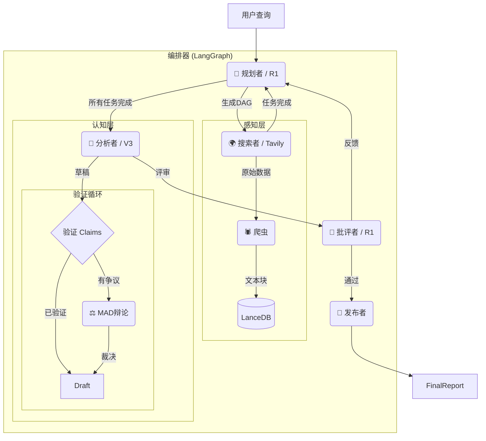

<div align="center">
  <image src="image/banner.png">

  <br/>

  <a href="https://python.org">
    
  </a>
  <a href="https://langchain-ai.github.io/langgraph/">
    
  </a>
  <a href="https://lancedb.com/">
    
  </a>
  <a href="https://tavily.com/">
    
  </a>
  <a href="https://opensource.org/licenses/MIT">
    
  </a>
  <br />
  <br />
  <p>
    <a href="README.md">English</a> | <a href="README_CN.md">中文</a>
  </p>
</p>
</div>


---

# 🌉 ApexBridge 深度研究系统

**ApexBridge** 是一个工业级的自主AI深度研究智能体，旨在架起复杂问题与真实答案之间的桥梁。

与传统RAG系统不同，ApexBridge采用 **"规划-解决"(Plan-and-Solve)** 架构，具备 **多智能体辩论(MAD)** 能力。它能够自主规划研究路径、执行并行搜索、验证事实，并进行自我修正，从而生成高质量、无幻觉的研究报告。

## ✨ 核心特性

* **🧠 自主规划 (DAG)**: 使用推理模型将复杂主题动态分解为有向无环图(DAG)任务。
* **⚖️ 多智能体辩论 (MAD)**: 自动将争议事实升级到"法庭"模式，正反方智能体进行辩论以达成裁决，确保事实准确性。
* **📉 分层模型策略**: 通过将任务路由到特定模型来优化成本和速度（例如，**DeepSeek R1** 用于规划/推理，**V3** 用于写作/提取）。
* **🛡️ 熔断器与安全机制**:
  * **认知层面**: 基于向量的语义循环检测，防止冗余研究路径。
  * **资源层面**: 全局超时和 `Tenacity` 重试机制，确保网络故障下的健壮性。
* **🔍 双搜索引擎**:
  * **Tavily**: 原生支持多Key轮询和高品质LLM友好结果。
  * **SearXNG**: 支持自托管、隐私优先的搜索。
* **📚 隔离知识库**: 使用 **LanceDB** 实现任务级向量隔离，确保数据安全，防止研究会话之间的上下文污染。

## 🏗️ 系统架构



## 🚀 快速开始

### 前置要求

- Python 3.10+
- [Tavily API Key](https://tavily.com/) (推荐) 或本地运行的 SearXNG 实例

### 安装

1. **克隆仓库**

   ```bash
   git clone [https://github.com/yourusername/ApexBridge.git](https://github.com/yourusername/ApexBridge.git)
   cd ApexBridge
   ```

2. **安装依赖**

   ```bash
   pip install -r requirements.txt
   ```

3. **配置**

   复制示例环境文件并编辑：

   ```bash
   cp .env.example .env
   ```

   **推荐的 `.env` 配置：**

   ```Ini, TOML
   # 搜索提供商 (tavily 或 searxng)
   SEARCH_PROVIDER=tavily

   # 支持多个Key，用逗号分隔，实现高并发/轮询
   TAVILY_API_KEYS=tvly-xxxxxx,tvly-yyyyyy

   # 模型提供商 (DeepSeek / OpenAI)
   DEEPSEEK_API_KEY=sk-xxxxxx

   # 分层模型策略 (自定义模型)
   MODEL_PLANNER=deepseek/deepseek-reasoner
   MODEL_WRITER=deepseek/deepseek-chat
   MODEL_CRITIC=deepseek/deepseek-reasoner
   ```

4. **运行服务**

   ```bash
   python main.py
   ```

   *服务将在 `http://0.0.0.0:23800` 启动*

5. **运行测试研究**

   打开新终端，运行测试脚本查看智能体实际运行：

   ```bash
   python test_runner.py
   ```

## 🛠️ 配置指南

配置通过 `app/core/config.py` 管理，可通过环境变量覆盖。

| **变量**            | **描述**                                    | **默认值**          |
| -------------------- | ------------------------------------------ | ------------------- |
| `SEARCH_PROVIDER`    | 搜索后端 (`tavily` / `searxng`)            | `tavily`            |
| `TAVILY_API_KEYS`    | 用于轮询的API密钥列表（逗号分隔）           | `[]`                |
| `GLOBAL_TIMEOUT_SEC` | 单个研究任务的硬超时                        | `600`               |
| `MODEL_PLANNER`      | 用于DAG生成的模型                           | `deepseek-reasoner` |
| `MODEL_WRITER`       | 用于报告撰写的模型                          | `deepseek-chat`     |
| `EMBEDDING_MODEL`    | 用于LanceDB的嵌入模型                      | `nomic-embed-text`  |

## 📄 开源协议

本项目基于 MIT 许可证开源 - 详见 [LICENSE](LICENSE) 文件。

------

<div align="center">
<p>由 ApexBridge 团队用心打造 ❤️</p>
</div>
